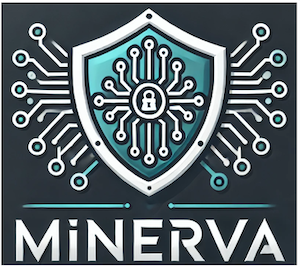

# This project is in early development!

A _FAST_ network scanner that identifies security vulnerabilities in your network and alerts you to new ones as they arise.

## Table of Contents

- [Introduction](#introduction)
  - [Features](#features)
- [Installation](#installation)
- [Development](#development)
- [Contributing](#contributing)
- [Contact](#contact)
- [License](#license)

## Introduction

Minerva is a network scanner that identifies security vulnerabilities in your network and alerts you to new ones as they arise. Minerva scans your network quickly using a combination of Nmap and a 3-pass scanning technique to identify hosts and open ports. It then uses the CVE database to identify vulnerabilities on a per-device basis.

Minerva is platform-agnostic - built with a FastAPI backend and a React frontend - available as a Docker container.

### Features:

- **Network Scanner:** Scans your network for hosts and open ports.
- **Vulnerability Scanner:** Identifies security vulnerabilities in your network on a per-device basis.
- **Scan and Vulnerability History:** Keeps a history of scans and vulnerabilities identified.
- **Alerting:** Alerts you to new vulnerabilities as they arise, new devices added to your network, given a network range.
- **Platform agnostic**: (Windows, MacOS, Linux).

## Installation

Download the Docker from: TODO

## Development

Please read the [DEVELOPMENT.md](DEVELOPMENT.md) file for more information on how to run this project locally.

## Contributing

Please read the [CONTRIBUTING.md](CONTRIBUTING.md) file for more information on how to contribute to this project.

## Contact

- Use **GitHub Issues** for code-related issues.

## License

Minerva is licensed under the [Apache License 2.0](LICENSE).
